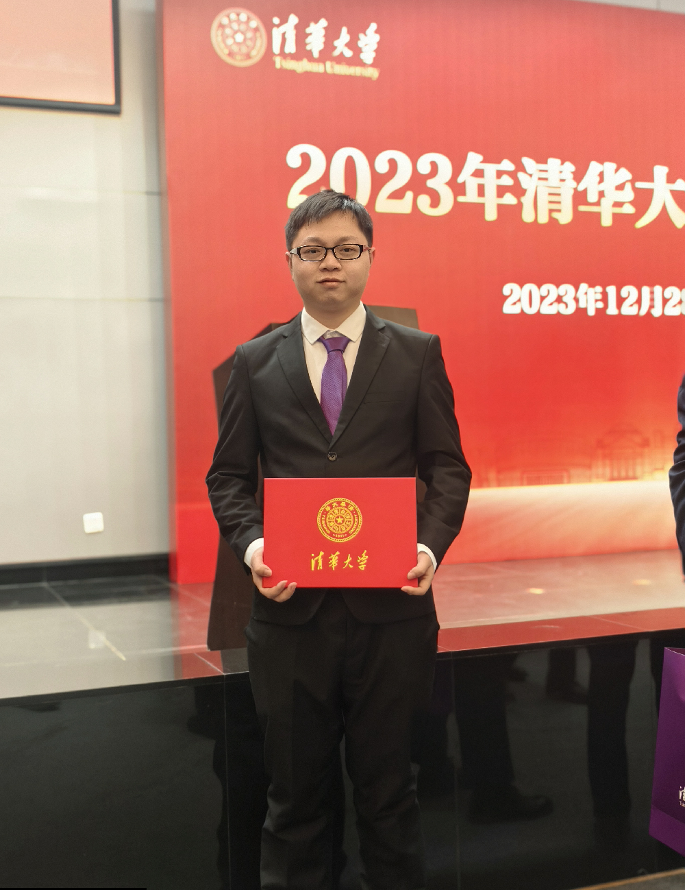

<table border="0">
  <tr>
    <td width="75%">
      <h1>Huan Wang</h1>
      
<b>Ph.D student at Reliability and Risk Management Lab</b>

      
Department of Industrial Engineering, Tsinghua University

      
Supervisor: Professor, Yan-Fu Li

      
Shunde Building, Tsinghua University, Beijing

      
Email: <b>wh.huanwang@gmail.com; huan-wan21@mails.tsinghua.edu.cn</b>

    </td>
    <td width="25%">
      
    </td>
  </tr>
</table>

## &nbsp; <b>Biography</b>
* * *
> I am a Ph.D. student in the Department of Industrial Engineering at Tsinghua University. I received my undergraduate and master's degrees in Mechanical Engineering from the University of Electronic Science and Technology of China in 2016 and 2021, respectively. Previously, I conducted in-depth research in medical information processing, focusing on medical image analysis and electrocardiogram diagnosis. Currently, my research interests lie in developing robust and trusted artificial intelligence solutions for complex electromechanical systems' intelligent diagnosis. I have a solid foundation in fault diagnosis and condition monitoring of rotating machinery, high-speed trains, semiconductor manufacturing, electric vehicles, and lithium-ion batteries. My expertise lies in efficiently and reliably applying artificial intelligence algorithms to solve real industrial problems.
To date, I have published more than 30 academic papers, including more than 20 SCI journal papers, and obtained several invention patents. Furthermore, I have been recognized for my contributions to the field, having won the Best Applied Paper Award at the Quality and Reliability Annual Conference of Tsinghua University, the Outstanding Paper Award of the China Industrial Engineering Doctoral Forum,China-Japan Friendship NSK Mechanical Engineering Outstanding Paper Award, Tsinghua University 129 Scholarship, Selected for the Future Professor Training Program, and the Outstanding Graduate of Sichuan Province.

## &nbsp; <b>Research Interests</b> [[Google Scholar]](https://scholar.google.com.hk/citations?user=Um0g-XMAAAAJ&hl=zh-CN&authuser=1)
* * *
* Deep Learning, Artificial Intelligence, Brain-Inspired Neural Network, Signal Analysis;
* Prognostics and System Health Management, Machinery Fault Diagnosis, Remaining Useful Life Estimation;
* Rotating Machinery, High-Speed Train, Semiconductor Manufacturing, Autonomous Vehicle, Lithium-ion Batteries, Medical Information Analysis.

## &nbsp; <b>Education and Experience</b>
* * *
* <b>Tsinghua University &nbsp;&nbsp;&nbsp;[2021 - present]</b>   
Ph.D. Management Science and Engineering, Department of Industrial Engineering

* <b>KU Leuven, Belgium &nbsp;&nbsp;&nbsp;[2022.12 - 2023.07]</b>   
Visiting scholar, Supervisor: Prof. Konstantinos Gryllias

* <b>University of Electronic Science and Technology of China &nbsp;&nbsp;&nbsp;[2018 - 2021]</b>   
M.S. Mechanical engineering, School of mechanical and electrical engineering

* <b>Sichuan Huluwa Trading Co., Ltd. and Chengdu Baizhiwu Technology Co., Ltd. &nbsp;&nbsp;&nbsp;[2016 - 2018]</b>   
Software development and entrepreneurship

* <b>University of Electronic Science and Technology of China &nbsp;&nbsp;&nbsp;[2012 - 2016]</b>   
B.S. Mechanical design, manufacturing and automation, School of mechanical and electrical engineering

## &nbsp; <b>Selected Journal Articles</b>
* * *
#### &nbsp;&nbsp;&nbsp; <b>Remark: # means equal contribution; * means corresponding author.</b>

### &nbsp;&nbsp;&nbsp; <b>2024-2025</b>

* <b>33. Huan Wang#</b>, Xindan Wang#, Yizhuo Yang#, Konstantinos Gryllias, and Zhiliang Liu*."A Few-Shot Machinery Fault Diagnosis Framework Based on Self-Supervised Signal Representation Learning", <b>IEEE Transactions on Instrumentation and Measurement, 2024, IF 5.6, [[PDF]](https://ieeexplore.ieee.org/)</b>.

### &nbsp;&nbsp;&nbsp; <b>2023-2024</b>

* <b>32. </b>Jiale Liu, <b>Huan Wang*</b>."A brain-inspired energy-efficient Wide Spiking Residual Attention Framework for intelligent fault diagnosis", <b>Reliability Engineering and System Safety, 2023, IF 8.1, [[PDF]](https://www.sciencedirect.com/science/article/abs/pii/S0951832023007871/)</b>.
* <b>31. </b>Yanggang Xu#, <b>Huan Wang#</b>, Zhiliang Liu*, and Mingjian Zuo."Self-Supervised Defect Representation Learning for Label-Limited Rail Surface Defect Detection", <b>IEEE Sensors Journal, 2023, IF 4.3, [[PDF]](https://ieeexplore.ieee.org/document/10288462/)</b>.
* <b>30. </b>Shicheng Pei, <b>Huan Wang*</b>, and Te Han."Time-Efficient Neural Architecture Search for Autonomous Underwater Vehicle Fault Diagnosis", <b>IEEE Transactions on Instrumentation and Measurement, 2023, IF 5.6, [[PDF]](https://ieeexplore.ieee.org/document/10295529)</b>.
* <b>29. Huan Wang</b>, Yan-Fu Li*, and Ying Zhang."Bioinspired Spiking Spatiotemporal Attention Framework for Lithium-ion Batteries State-of-Health Estimation", <b>Renewable and Sustainable Energy Reviews, 2023, IF 15.9, [[PDF]](https://www.sciencedirect.com/science/article/abs/pii/S1364032123005853)</b>.
* <b>28. </b>Tianyou Bai and <b>Huan Wang*</b>."Convolutional Transformer-Based Multi-View Information Perception Framework for Lithium-ion Battery State-of-Health Estimation", <b>IEEE Transactions on Instrumentation and Measurement, 2023, IF 5.6, [[PDF]](https://ieeexplore.ieee.org/abstract/document/10198842)</b>.
* <b>27. </b>Yan-Fu Li*, <b>Huan Wang*</b> and Muxia Sun."ChatGPT-Like Large-Scale Foundation Models for Prognostics and Health Management: A Survey and Roadmaps", <b>Reliability Engineering and System Safety, 2023, IF 8.1, [[PDF]](https://www.sciencedirect.com/science/article/pii/S0951832023007640)</b>.
* <b>26. Huan Wang</b>, Muxia Sun* and Yan-Fu Li."A Brain-Inspired Spiking Network Framework Based on Multi-Time-Step Self-Attention for Lithium-ion Batteries Capacity Prediction", <b>IEEE Transactions on Consumer Electronics, 2023, IF 4.3, [[PDF]](https://ieeexplore.ieee.org/document/10132013)</b>.
* <b>25. Huan Wang</b>, Yan-Fu Li* and Jianliang Ren."Machine Learning for Fault Diagnosis of High-Speed Train Traction Systems: A Review", <b>Frontiers of Engineering Management, 2023, IF 7.4, [[PDF]](https://journal.hep.com.cn/fem/EN/10.1007/s42524-023-0256-2)</b>.
* <b>24. Huan Wang</b>, Zhiliang Liu*, Dandan Peng and Ming J. Zuo."Interpretable Convolutional Neural Network with Multilayer Wavelet for Noise-Robust Machinery Fault Diagnosis", <b>Mechanical Systems and Signal Processing, 2023, IF 8.4, [[PDF]](https://www.sciencedirect.com/science/article/pii/S0888327023002212)</b>.
* <b>23. </b>Wenjun Luo and <b>Huan Wang*</b>."Composite Wafer Defect Recognition Framework based on Multi-View Dynamic Feature Enhancement with Class-Specific Classifier", <b>IEEE Transactions on Instrumentation and Measurement, 2023, IF 5.6, [[PDF]](https://ieeexplore.ieee.org/document/10081449)</b>.
* <b>22. </b>Yuxiang Wei and <b>Huan Wang*</b>."Wavelet integrated attention network with multi-resolution frequency learning for mixed-type wafer defect recognition", <b>Engineering Applications of Artificial Intelligence, 2023, IF 8.0, [[PDF]](https://www.sciencedirect.com/science/article/pii/S0952197623001598)</b>.
* <b>21. Huan Wang</b> and Yan-Fu Li*."Bioinspired Membrane Learnable Spiking Neural Network  for Autonomous Vehicle Sensors Fault Diagnosis under Open Environments", <b>Reliability Engineering and System Safety, 2023, IF 8.1, [[PDF]](https://www.sciencedirect.com/science/article/pii/S0951832023000170)</b>.
* <b>20. </b>Yipu Wang and <b>Huan Wang*</b>."Wavelet Attention-Powered Neural Network Framework  with Hierarchical Dynamic Frequency Learning for Lithium-ion Battery State of Health Prediction", <b>Journal of Energy Storage, 2023, IF 9.4, [[PDF]](https://www.sciencedirect.com/science/article/pii/S2352152X23000944)</b>.

### &nbsp;&nbsp;&nbsp; <b>2022-2023</b>
* <b>19. </b>Yitian Wang, Yuxiang Wei, <b>Huan Wang*</b>."A Class Imbalanced Wafer Defect Classification Framework Based on Variational Autoencoder Generative Adversarial Network", <b>Measurement Science and Technology, 2022, IF 2.4, [[PDF]](https://iopscience.iop.org/journal/0957-0233)</b>.
* <b>18. Huan Wang</b>, and Yan-Fu Li*."Robust Mechanical Fault Diagnosis with Noisy Label Based on Multi-Stage True Label  Distribution Learning", <b>IEEE Transactions on Reliability, 2022, IF 5.9, [[PDF]](https://ieeexplore.ieee.org/document/9847568)</b>.
* <b>17. Huan Wang</b>, and Yan-Fu Li*."Iterative Error Self-Correction for Robust Fault Diagnosis of Mechanical Equipment with Noisy Label", <b>IEEE Transactions on Instrumentation and Measurement, 2022, IF 5.6, [[PDF]](https://ieeexplore.ieee.org/document/9825673)</b>.
* <b>16. </b>Yuxiang Wei, and <b>Huan Wang*</b>." Mixed-type Wafer Defect Pattern Recognition Framework based on Multi-Faceted Dynamic Convolution", <b>IEEE Transactions on Instrumentation and Measurement, 2022, IF 5.6, [[PDF]](https://ieeexplore.ieee.org/document/9783021)</b>.
* <b>15. Huan Wang</b>, Zhiliang Liu*, and Ting Ai. "Long-range Dependencies Learning Based on Non-Local 1D-Convolutional Neural Network for Rolling Bearing Fault Diagnosis", <b>Journal of Dynamics, Monitoring and Diagnostics, 2022, [[PDF]](https://ojs.istp-press.com/dmd/article/view/53)</b>.
* <b>14. </b>Yuxiang Wei, and <b>Huan Wang*</b>. "Mixed-Type Wafer Defect Recognition with Multi-Scale Information Fusion Transformer", <b>IEEE Transactions on Semiconductor Manufacturing, 2022, IF 2.7, [[PDF]](https://ieeexplore.ieee.org/document/9728745)</b>.
* <b>13. Huan Wang</b>, Tianli Men, and Yan-Fu Li*. "Transformer for High-Speed Train Wheel Wear Prediction with Multiplex Local-Global Temporal Fusion", <b>IEEE Transactions on Instrumentation and Measurement, 2022, IF 5.6, [[PDF]](https://ieeexplore.ieee.org/document/9721893)</b>.

### &nbsp;&nbsp;&nbsp; <b>2021-2022</b>
* <b>12. Huan Wang</b>, Zhiliang Liu*,Yipei Ge, and Dandan Peng. "Self-Supervised Signal Representation Learning for Machinery Fault Diagnosis under Limited Annotation Data", <b>Knowledge-Based Systems, 2021, IF 8.8, [[PDF]](https://www.sciencedirect.com/science/article/pii/S0950705121010996)</b>.
* <b>11. Huan Wang</b>, Zhiliang Liu*, Dandan Peng, and Zhe Cheng. "Attention-Guided Joint Learning CNN with Noise Robustness for Bearing Fault Diagnosis and Vibration Signal Denoising", <b>ISA Transactions, 2021, IF 7.3, [[PDF]](https://www.sciencedirect.com/science/article/pii/S0019057821005991)</b>.
* <b>10. </b>Zuhao Liu,<b>Huan Wang*</b>, Yibo Gao, and Shunchen Shi. "Automatic Attention Learning Using Neural Architecture Search for Detection of Cardiac Abnormality in 12-lead ECG", <b>IEEE Transactions on Instrumentation and Measurement, 2021, IF 5.6, [[PDF]](https://ieeexplore.ieee.org/document/9526630)</b>.
* <b>9. Huan Wang</b>, Zhiliang Liu*, Dandan Peng, Mei Yang, and Yong Qin. "Feature-Level Attention-Guided Multitask CNN for Fault Diagnosis and Working Conditions Identification of Rolling Bearing", <b>IEEE Transactions on Neural Networks and Learning Systems, 2021, IF 10.4, [[PDF]](https://ieeexplore.ieee.org/document/9372133)</b>.
* <b>8. </b>Xinwen Liu, <b>Huan Wang*</b>, Zongjin Li, and Lang Qin. "Deep Learning in ECG Diagnosis: A Review", <b>Knowledge-Based Systems, 2021, IF 8.8, [[PDF]](https://www.sciencedirect.com/science/article/abs/pii/S0950705121004494)</b>.
* <b>7. </b>Lang Qin, Yuntao Xie, Xinwen Liu, Xiangchi Yuan, and <b>Huan Wang*</b>. "An End-to-End 12-Leading Electrocardiogram Diagnosis System Based on Deformable Convolutional Neural Network With Good Antinoise Ability", <b>IEEE Transactions on Instrumentation and Measurement, 2021, IF 5.6, [[PDF]](https://ieeexplore.ieee.org/document/9406046/)</b>.
* <b>6. </b>Yibo Gao, <b>Huan Wang*</b>, and Zuhao Liu. "An End-to-end Atrial Fibrillation Detection by a Novel Residual-based Temporal Attention Convolutional Neural Network with Exponential Nonlinearity Loss", <b>Knowledge-Based Systems, 2021, IF 8.8, [[PDF]](https://www.sciencedirect.com/science/article/abs/pii/S0950705120307188)</b>.
* <b>5. </b>Haoran Han#, <b>Huan Wang#</b>, Zhiliang Liu*, and Jiayi Wang. "Intelligent Vibration Signal Denoising Method based on Non-local Fully Convolutional Neural Network for Rolling Bearings", <b>ISA transactions, 2021, IF 7.3, [[PDF]](https://www.sciencedirect.com/science/article/abs/pii/S0019057821002196)</b>.

### &nbsp;&nbsp;&nbsp; <b>2019-2021</b>
* <b>4. </b>Dandan Peng#, <b>Huan Wang#</b>, Zhiliang Liu*, Zijiang Liu, Ming J. Zuo, and Chen Jian. "Multibranch and Multiscale CNN for Fault Diagnosis of Wheelset Bearings Under Strong Noise and Variable Load Condition", <b>IEEE Transactions on Industrial Informatics, 2020, IF 12.3, [[PDF]](https://ieeexplore.ieee.org/document/8962243)</b>.
* <b>3. </b>Zhiliang Liu, <b>Huan Wang* </b>, Junjie Liu, Yong Qin*, and Dandan Peng. "Multi-task Learning Based on Lightweight 1DCNN for Fault Diagnosis of Wheelset Bearings", <b> IEEE Transactions on Instrumentation and Measurement, 2020. IF: 5.6, [[PDF]](https://ieeexplore.ieee.org/document/9178459)</b>.
* <b>2. Huan Wang</b>, Zhiliang Liu*, Dandan Peng, and Yong Qin. "Understanding and Learning Discriminant Features based on Multiattention 1DCNN for Wheelset Bearing Fault Diagnosis", <b>IEEE Transactions on Industrial Informatics, 2019, IF 12.3, [[PDF]](https://ieeexplore.ieee.org/document/8911240)</b>.
* <b>1. </b>Dandan Peng, Zhiliang Liu*, <b>Huan Wang</b>, Yong Qin, and Limin Jia. "A Novel Deeper One-dimensional CNN with Residual Learning for Fault Diagnosis of Wheelset Bearings in High Speed Trains", <b>IEEE Access, 2018, IF 3.9, [[PDF]](https://ieeexplore.ieee.org/document/8584445)</b>.

## &nbsp; <b>Selected Conference Articles</b>
* * *
* <b>6. Huan Wang</b> and Yan-Fu Li*. "Large Language Model Empowered by Domain-Specific Knowledge Base for Industrial Equipment Operation and Maintenance.", <b>SRSE 2023</b>.
* <b>5. Huan Wang</b> and Yan-Fu Li*. "Large-Scale Language Models for PHM in Railway Systems - Potential Applications, Limitations, and Solutions", <b>EITRT 2023</b>.
* <b>4. Huan Wang</b>, Guotai Wang*, Ze Sheng, Shaoting Zhang. "Automated Segmentation of Skin Lesion Based on Pyramid Attention Network", <b>MLMI 2019</b>.
* <b>3. Huan Wang</b>, Guotai Wang*, Zijian Liu, Shaoting Zhang. "Global and Local Multi-Scale Feature Fusion Enhancement for Brain Tumor Segmentation and Pancreas Segmentation", <b>BrainLes 2019</b>.
* <b>2. Huan Wang</b>, Guotai Wang*, Zhihan Xu, Wenhui Lei, Shaoting Zhang."High- and Low-Level Feature Enhancement for Medical Image Segmentation", <b>MLMI 2019</b>.
* <b>1. Huan Wang</b>, Ran Gu#, Zhongyu Li*. "Automated Segmentation of Intervertebral Disc Using Fully Dilated Separable Deep Neural Networks", <b>CSI 2018</b>.

## &nbsp; <b>Chinese Invention Patents</b>
* * *
* <b>9. </b>Yan-Fu Li, <b>Huan Wang</b>, Method, device and device for correcting sensor signals of autonomous driving vehicles (自动驾驶汽车上传感器的检测信号校正方法、装置和设备), Patent-pending.
* <b>8. </b>Yan-Fu Li, <b>Huan Wang</b>, Vehicle sensor health state monitoring method, device and computer equipment (车辆传感器健康状态监测方法、装置和计算机设备), Patent-pending.
* <b>7. </b>Yan-Fu Li, <b>Huan Wang</b>, Unmanned equipment fault diagnosis method, device, equipment, storage medium and product (无人设备故障诊断方法、装置、设备、存储介质和产品), Patent-pending.
* <b>6. </b>Yan-Fu Li, Tianli Men, <b>Huan Wang</b>, Full lifecycle management system and method for locomotive axles based on data-driven (基于数据驱动的机车车辆轮轴全生命周期管理系统及方法), Patent-pending.
* <b>5. </b>Yan-Fu Li, <b>Huan Wang</b>, Training Method of Wheel Wear Prediction Network Model Based on Wavelet Transform (基于小波变换的车轮磨损预测网络模型训练方法), Patent-pending.
* <b>4. </b>Yan-Fu Li, <b>Huan Wang</b>, Wheel wear prediction network model training method and device (车轮磨损预测网络模型训练方法、装置), Patent-pending.
* <b>3. </b>Zhiliang Liu, Dandan Peng, <b>Huan Wang</b>, The rotating machinery fault diagnosis method based on a deep residual convolutional neural network (基于一维深度残差卷积神经网络的旋转机械故障诊断方法).
* <b>2. </b>Zhiliang Liu, <b>Huan Wang</b>, Dandan Peng, Yijia Hao, Junhao Zhang, The rolling bearing fault diagnosis method based on multi-branch multi-scale convolution neural network (基于多分支多尺度卷积神经网络的滚动轴承故障诊断方法). 
* <b>1. </b>Zhiliang Liu, <b>Huan Wang</b>, Dandan Peng, Yijia Hao, Junhao Zhang, The Rotating machinery fault diagnosis method based on multi-attention convolutional neural network (基于多注意力卷积神经网络的旋转机械故障诊断方法).

## &nbsp; <b>Honors & Awards</b>
* * *
* <b>21. </b>Tsinghua University 129 Scholarship (清华大学一二九奖学金, 清华大学三大奖之一，2023年清华大学学生奖励大会上获校级表彰)
* <b>20. </b>Selected for Future Professor Training Program (入选未来教授培养计划)
* <b>19. </b>Excellent Award in the 2023 China Intelligent Transportation Technology Innovation Competition (2023年中国智能交通科创大赛-基于ADS-B的飞行流量预测优胜奖,并列第四名））
* <b>18. </b>Second Prize in the 2023 China Intelligent Transportation Technology Innovation Competition (2023年中国智能交通科创大赛-智能网联汽车网络与数据安全二等奖，并列第二名）
* <b>17. </b><b>Outstanding Oral Presentation Award </b> of 5th International Conference on System Reliability and Safety Engineering (第五届系统可靠性与安全工程国际会议优秀口头报告奖), 2023
* <b>16. </b>First Class Scholarship of Tsinghua University,Yantai Talent Scholarship (清华大学综合一等奖学金, 烟台英才奖学金), 2023
* <b>15. </b>2023 China-Japan Friendship NSK Mechanical Engineering <b> Outstanding Paper Award</b> (2023年中日友好NSK机械工学优秀论文奖)
* <b>14. </b>Tsinghua Scholarship for Overseas Graduate Studies (清华大学博士生短期出国访学奖学金)
* <b>13. </b>Second Prize of the 2022 China Digital Vehicle Competition-Power Battery Safety Risk Assessment and Fault Warning (2022年中国数字汽车大赛二等奖-动力电池安全风险评估与故障预警)
* <b>12. </b>Third Prize of 2022 Guangdong-Hong Kong-Macau International Algorithm Competition-Surface Defect Detection of Industrial Products (粤港澳大湾区国际算法算例大赛优胜奖-工业品表面缺陷检测)
* <b>11. </b><b> Outstanding Paper Award </b> of China Industrial Engineering Doctoral Forum (2022年全国工业工程博士生论坛优秀论文奖)
* <b>10. </b>First Class Scholarship of Tsinghua University,Samsung Scholarship (清华大学综合一等奖学金, 三星奖学金), 2022
* <b>9. </b><b>Best Applied Paper </b> Award of the Quality and Reliability Annual Conference of Tsinghua University (2022年清华大学质量与可靠性研究院年会最佳应用论文奖)
* <b>8. </b>2021 QSR Data Challenge Award Finalists of “In-Situ Quality Process Monitoring in Additive Manufacturing”, Third place
* <b>7. </b>Excellent university graduate of sichuan province (四川省优秀大学毕业生), 2020
* <b>6. </b>National Scholarship for Postgraduates (硕士研究生国家奖学金), 2020
* <b>5. </b>First Prize of Academic Scholarship, University of Electronic Science and Technology of China, 2020
* <b>4. </b>Second Prize of Academic Scholarship, University of Electronic Science and Technology of China, 2019
* <b>3. </b>Second Prize of Academic Scholarship, University of Electronic Science and Technology of China, 2018
* <b>2. </b>2nd Runner up in the automatic structure segmentation for radiotherapy planing challenge 2019
* <b>1. </b>Third Prize of Bladder MRI Image Segmentation Challenge - 3rd International Symposium on Image Computing and Digital Medicine (ISICDM) 2019

## &nbsp; <b>Professional Services</b>
* * *
### &nbsp;&nbsp;&nbsp; <b>Journal Reviews</b>

* IEEE Transactions on Neural Networks and Learning Systems
* IEEE Transactions on Instrumentation and Measurement
* IEEE Transactions on Semiconductor Manufacturing
* IEEE Transactions on Industrial Informatics
* Reliability Engineering & System Safety
* Artificial Intelligence in Medicine
* IEEE Transactions on Reliability
* Knowledge-Based Systems
* ISA Transactions
* Neurocomputing
* Measurement
* ......

* * *
### &nbsp;&nbsp;&nbsp; <b>Other Services</b>

* Web Master of 2nd International Workshop on Reliability of Autonomous Intelligent Systems, [RAIS 2022](https://rais-workshop.github.io/), Co-located with ISSRE 2022.
* Head of Intelligent Star student research team of UESTC, it has been publicized and reported on school and college websites for many times (Chinese [[News Link-1]](https://news.uestc.edu.cn/?n=UestcNews.Front.DocumentV2.ArticlePage&Id=81320), [[News Link-2]](https://www.gla.uestc.edu.cn/info/1083/11045.htm), and [[News Link-3]](https://www.gla.uestc.edu.cn/info/1083/9935.htm)).
* IEEE Reliability Society Beijing Chapter, Academic activity notification and organization.

